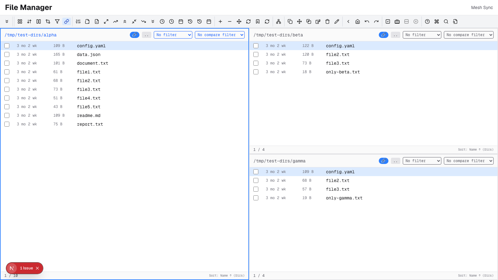

# Panorama - Multi-Target File Manager with Visual Sync

**Version**: 0.5.1  
**Last Updated**: 2026-02-10

**Panorama** is a modern **multi-pane file manager** built for **visual multi-destination sync with verification** — see all targets at once and confirm every copy. Built with Next.js, React 19, TypeScript, and Tailwind CSS v4, following **TIED** (Traceability-Integrated Engineering Documentation) methodology for complete traceability from requirements through implementation. Project records live under [`tied/`](tied/).

Browse and manage server files with keyboard-driven navigation, **1 pane or more** (no upper limit; 3 panes by default), file operations, visual comparison across panes, content search, and a comprehensive toolbar system with 36+ discoverable operations.

## Why Panorama?

**The Problem**: Traditional file managers only show two panes. When syncing files to multiple destinations (backup drives, cloud storage, network shares), you can't see all targets simultaneously, making it hard to verify what went where.

**The Solution**: Panorama's multi-pane layout shows **all** your destinations at once. Copy or move files to every visible pane in a single operation, with visual comparison to verify results instantly.

**Use Cases**:
- **Multi-Target Backup**: Copy important files to 2-3 backup drives simultaneously and verify each destination
- **Directory Comparison**: Open 3-5 versions of a project and see differences across all at once with color-coded indicators
- **Parallel Deployment**: Sync files to multiple servers and visually confirm each deployment
- **USB Drive Sync**: Copy media to multiple devices in one operation, see all targets' contents side-by-side
- **Archive Distribution**: Distribute files to multiple locations and verify nothing was missed

## Features

### Core File Manager
- **Multi-Pane Layout** – 1 pane or more, no upper limit; 3 panes by default. Add or remove panes via the Layout toolbar; configurable startup paths and automatic layout calculation
- **Keyboard Navigation** – Vim-inspired keybindings with hjkl movement, Enter to open directories, Backspace for parent, Tab to switch panes
- **File Operations** – Copy, move, delete, rename with visual confirmation dialogs and progress feedback
- **Linked Navigation** [REQ-LINKED_PANES] – Toggleable mode (L key) synchronizes directory changes, cursor position, and sort settings across all panes; Parent button respects linked mode automatically
- **Visual Comparison** – Cross-pane file comparison with color-coded indicators (same, different, unique, size, time)
- **Parent Navigation Button** – Mouse-accessible `..` button in each pane header for navigating to parent directory (visible when not at root)
- **Content Search** – Full-text search across files with regex support, recursive directory scanning, and match highlighting
- **Finder Dialog** – Quick file filtering with fuzzy matching (press `/` to activate)
- **Directory History** – Navigate back/forward through visited directories with cursor position restoration
- **Bookmarks** – Save frequently accessed directories for quick navigation
- **Manual Refresh** – Force refresh current pane (Ctrl+R) or all panes to reflect external file system changes
- **Sort Options** – Sort by name, size, modification time, or extension (ascending/descending, directories first)
- **File Marking** – Mark multiple files for bulk operations (Space to mark, Shift+M to mark all)

### Visual Toolbar System [REQ-TOOLBAR_SYSTEM]
- **Three Toolbar Types**: Workspace (global actions like layout/refresh), Pane (file operations), System (help/search)
- **Compact Icon Design**: Icon + keystroke badges for maximum density (no overflow with 12+ buttons)
- **Context Awareness**: Active/disabled states reflect workspace context (e.g., Copy disabled without marks)
- **Configuration-Driven**: Complete customization via `config/files.yaml` and `config/theme.yaml`
- **Keyboard Consistency**: Toolbar actions dispatch to the same handlers as keyboard shortcuts

### Multi-Destination Sync [REQ-NSYNC_MULTI_TARGET] - Panorama's Signature Feature

**The Core Value**: See all destinations while syncing. Mark files in one pane, press Shift+C, and watch them copy to **every other visible pane** simultaneously. No switching between destinations, no uncertainty about what went where.

**How It Works**:
1. **Open multiple panes** – Your source + all destinations (e.g., source drive + 3 backup drives = 4 panes)
2. **Mark files** in the source pane (Space key to mark each file, or Shift+M for all)
3. **Press Shift+C** (Copy to All Panes) or **Shift+V** (Move to All Panes)
4. **Confirm once** – Dialog shows exactly which panes will receive the files
5. **Visual verification** – Watch files appear in all destination panes; color-coded comparison confirms success

**Key Features**:
- **Copy to All Panes / Move to All Panes** – Sync files from the focused pane to all other visible panes in one action (Shift+C, Shift+V)
- **Parallel Sync** – Multi-destination orchestration with parallel copy per source and observer pattern for progress
- **Safe Move Semantics** [REQ-MOVE_SEMANTICS] – Source files deleted only after ALL destinations succeed; partial failure leaves source intact
- **Smart Skip** [REQ-COMPARE_METHODS] – Skip unchanged files via `none`, `size`, `mtime`, `size-mtime`, or `hash` (default: `size-mtime`)
- **Hash Verification** [REQ-HASH_COMPUTATION] – BLAKE3, SHA-256, and XXH3 with streaming for large files; optional post-copy verification
- **Destination Verification** [REQ-VERIFY_DEST] – Optional recompute of destination hash after copy to detect corruption
- **Store Failure Detection** [REQ-STORE_FAILURE_DETECT] – Error streak tracking per destination; sync aborts when a store is marked unavailable (e.g., ejected USB drive)

**Why This Matters**: 
- **Speed**: One operation syncs to N destinations (not N separate operations)
- **Safety**: Move deletes source only after ALL destinations succeed
- **Confidence**: Visual comparison confirms every file reached every destination
- **Efficiency**: Skips files that are already up-to-date using fast comparisons

### Configuration System
- **YAML Configuration** – All file manager settings (keybindings, layout, columns, toolbars, startup paths) in `config/files.yaml`
- **Theme Customization** – Colors, fonts, spacing, and per-element class overrides in `config/theme.yaml`
- **Configurable Columns** [IMPL-FILE_COLUMN_CONFIG] – Show/hide columns (name, size, mtime) and format time display (age or absolute)
- **File Type Icons** – Configurable icons and colors for different file types (code, images, archives, documents, etc.)

### Technical Stack
- **Next.js 16.1** with App Router and React Server Components
- **React 19.2** with modern concurrent features
- **TypeScript 5.x** with strict mode for type safety
- **Tailwind CSS v4** with mobile-first responsive design
- **Dark Mode** with automatic system preference detection
- **Optimized Fonts** using next/font with Geist Sans and Geist Mono
- **TIED documentation** with full requirements traceability (`tied/`)
- **Comprehensive Testing** with Vitest and React Testing Library (576 tests passing)

## Quick Start

### Installation

1. **Clone the repository**:
   ```bash
   git clone <repository-url>
   cd nx1
   ```

2. **Install dependencies**:
   ```bash
   npm install
   ```

3. **Start the development server**:
   ```bash
   npm run dev
   ```

4. **Open the file manager**:
   - Navigate to http://localhost:3000 (redirects to `/files`)
   - The file manager opens with your home directory in **3-pane mode** (use the Layout toolbar to add or remove panes; 1 pane minimum, no upper limit)

### Screenshots & Demo (3-pane default; 1 pane or more, no limit)

The file manager **defaults to 3 panes** and supports **1 pane or more with no upper limit**. Visual demos for the README should show **3-pane layout** as the primary experience.

| Layout   | Use case |
|----------|----------|
| **3 panes (default)** | Recommended: compare directories, sync to multiple targets, keep source and two destinations visible. |
| **More panes**        | Add via Layout toolbar for extra targets or comparison; no fixed maximum. |
| **2 or 1 pane**       | Remove panes via Layout toolbar for simpler side-by-side or single-pane use. |

**Demo directory for screenshots / GIFs:** `/tmp/test-5dirs/` has a good structure for demos (subdirs `alpha`, `beta`, `delta`, `epsilon`, `gamma` with deliberate differences). Create it with the script `scripts/setup_test_dirs.sh` from the [Goful](https://github.com/nickshanks/goful) repo. Point panes at subdirs of `/tmp/test-5dirs/` for consistent, comparable content.

**3-pane workspace (default layout):**



**Visual comparison mode** (color-coded indicators across panes):


**Copy to All Panes in action** (mark files → Shift+C → sync to all targets):


The GIF demonstrates Panorama's signature feature: mark files in one pane, press Shift+C, and copy them to **all** other visible panes simultaneously. Visual confirmation shows files appearing in each destination instantly.

### Automated Demo Recording

The CopyAll demo GIF above was generated using **fully automated browser testing** with Playwright. No human clicking required!

**One-Command Demo**:
```bash
npm run demo:record
```

This command:
1. **Resets test directories** (`/tmp/test-dirs/alpha`, `beta`, `gamma` with sample files)
2. **Starts the dev server** automatically
3. **Launches browser** with pre-configured panes via URL (see URL Deep Linking below)
4. **Performs the demo** – marks files, triggers CopyAll, confirms dialog
5. **Captures screenshots** at each step (4 PNG files)
6. **Records video** of the entire workflow
7. **Converts to GIF** (optimized with ffmpeg + gifsicle)

**Output**: 4 professional screenshots + 1 optimized GIF (1.9 MB) in `docs/screenshots/`

**Individual Commands**:
```bash
npm run demo:setup     # Reset test directories only
npm run test:e2e       # Run E2E test (headless)
npm run demo:convert   # Convert video to GIF
npm run test:e2e:headed # Run with visible browser (debugging)
```

See `DEMO_AUTOMATION_README.md` for full details on the automation infrastructure.

### URL Deep Linking

**New Feature**: Pre-configure panes via URL query parameters for instant setup:

```
http://localhost:3000/files?pane0=/path1&pane1=/path2&pane2=/path3
```

**Example**:
```bash
npm run dev
open "http://localhost:3000/files?pane0=/tmp/test-dirs/alpha&pane1=/tmp/test-dirs/beta&pane2=/tmp/test-dirs/gamma"
```

Panes instantly load with the specified directories—perfect for:
- **Bookmarkable workflows**: Save complex multi-pane setups as browser bookmarks
- **Testing**: E2E tests use URL params to set up scenarios instantly (no UI navigation)
- **Documentation**: Share exact file manager states via shareable links
- **Reproducibility**: Demo scripts can create consistent starting states

### Keyboard Shortcuts

The file manager is keyboard-driven for efficiency:

#### Navigation
- `↑/↓` or `k/j` – Move cursor up/down
- `Enter` – Enter directory or open file
- `Backspace` – Navigate to parent directory
- `Tab` – Switch to next pane
- `H` – Navigate to home directory
- `B` – Show bookmarks dialog
- `[` / `]` – Navigate back/forward in history

#### File Operations
- `Space` – Mark file under cursor (and move down)
- `M` – Toggle mark on current file
- `Shift+M` – Mark all files
- `U` – Clear all marks
- `C` – Copy marked files
- `V` – Move marked files
- `D` – Delete marked files
- `R` – Rename file under cursor
- `Shift+C` – Copy marked files to all other panes
- `Shift+V` – Move marked files to all other panes

#### View & Sort
- `S` – Show sort dialog
- `=` – Toggle comparison mode
- `.` – Toggle hidden files
- `L` – Toggle linked navigation mode
- `Ctrl+R` – Refresh current pane
- `Shift+R` – Refresh all panes

#### Search & Help
- `/` – Finder dialog (quick file filter)
- `Ctrl+F` – Content search dialog
- `P` – Command palette
- `?` – Show keyboard shortcuts help

### Customization

#### File Manager Configuration (`config/files.yaml`)

```yaml
layout:
  default: "tile"              # tile | oneRow | oneColumn | fullscreen
  defaultPaneCount: 3          # Number of panes on startup (3 recommended)
  allowPaneManagement: true    # Allow adding/removing panes
  maxPanes: 0                  # 0 = no upper limit; set a number to cap panes
  defaultLinkedMode: true      # Start with linked navigation enabled

startup:
  mode: "home"                 # home | configured | last
  paths:                       # Startup paths when mode = "configured"
    pane1: "~"
    pane2: "~/Documents"
    pane3: "~/Downloads"
  rememberLastLocations: false # Remember last visited directories

columns:                       # Visible columns and their format
  - id: mtime
    visible: true
    format: "age"              # "age" for relative time, "absolute" for YYYY-MM-DD HH:MM:SS
  - id: size
    visible: true
  - id: name
    visible: true
```

#### Theme Configuration (`config/theme.yaml`)

```yaml
colors:
  light:
    background: "#ffffff"
    foreground: "#171717"
  dark:
    background: "#0a0a0a"
    foreground: "#ededed"

files:
  overrides:                   # Per-element class overrides
    paneContainer: ""
    paneFocused: ""
    fileRow: ""
    fileCursor: ""
  compareColors:               # File comparison colors
    same: "bg-zinc-100 dark:bg-zinc-800"
    different: "bg-red-100 dark:bg-red-900"
    unique: "bg-yellow-100 dark:bg-yellow-900"
  fileTypes:                   # File type icons and colors
    code:
      icon: "💻"
      iconClass: "text-purple-500 dark:text-purple-400"
      patterns: ["*.ts", "*.tsx", "*.js", "*.jsx", "*.py", "*.go"]
    image:
      icon: "🖼️"
      iconClass: "text-green-500 dark:text-green-400"
      patterns: ["*.jpg", "*.png", "*.gif", "*.webp"]
```

## Prerequisites

- **Node.js**: v18.17 or later (LTS recommended)
- **npm**: v9.x or later (comes with Node.js)

Check your versions:
```bash
node --version  # Should be v18.17+
npm --version   # Should be v9.x+
```

## Development Workflow

### Testing

**Run all tests**:
```bash
npm test
```

**Run tests in watch mode** (recommended during development):
```bash
npm run test:watch
```

**Generate coverage report**:
```bash
npm run test:coverage
```

**Current Status**: 576 tests passing, 3 skipped

### Linting

Run ESLint to check code quality:
```bash
npm run lint
```

Fix auto-fixable issues:
```bash
npm run lint -- --fix
```

### Building for Production

Create an optimized production build:
```bash
npm run build
```

Start the production server:
```bash
npm start
```

The production server runs at http://localhost:3000

## Project Structure

```
nx1/
├── config/                        # YAML configuration files
│   ├── site.yaml                 # Site metadata (minimal for file manager)
│   ├── theme.yaml                # Colors, fonts, spacing, file manager theme
│   └── files.yaml                # File manager configuration
├── src/
│   ├── app/                       # Next.js App Router
│   │   ├── layout.tsx            # Root layout [IMPL-ROOT_LAYOUT]
│   │   ├── page.tsx              # Redirects to /files [IMPL-FILE_MANAGER_PAGE]
│   │   ├── globals.css           # Global styles [IMPL-DARK_MODE]
│   │   ├── files/                # File manager pages
│   │   │   ├── page.tsx          # File manager server page
│   │   │   ├── WorkspaceView.tsx # Multi-pane workspace (client)
│   │   │   └── components/       # File manager components
│   │   │       ├── FilePane.tsx  # Single pane display
│   │   │       ├── Toolbar.tsx   # Toolbar system
│   │   │       ├── CommandPalette.tsx
│   │   │       ├── SearchDialog.tsx
│   │   │       └── ... (other dialogs)
│   │   └── api/                  # API routes
│   │       └── files/            # File operations API
│   │           ├── route.ts      # List, copy, move, delete, sync
│   │           ├── info/route.ts
│   │           ├── preview/route.ts
│   │           └── search/route.ts
│   ├── lib/                       # Shared modules
│   │   ├── config.ts             # Config loader [IMPL-CONFIG_LOADER]
│   │   ├── config.types.ts       # Configuration TypeScript interfaces
│   │   ├── files.*.ts            # File manager modules
│   │   │   ├── files.data.ts     # File operations
│   │   │   ├── files.types.ts    # TypeScript types
│   │   │   ├── files.utils.ts    # Utilities
│   │   │   ├── files.keybinds.ts # Keybinding system
│   │   │   ├── files.layout.ts   # Layout calculation
│   │   │   ├── files.history.ts  # Directory history
│   │   │   ├── files.bookmarks.ts # Bookmarks
│   │   │   ├── files.search.ts   # Content search
│   │   │   └── files.comparison.ts # File comparison
│   │   ├── sync/                 # Multi-destination sync engine
│   │   │   ├── engine.ts         # Sync orchestration
│   │   │   ├── operations.ts     # File operations
│   │   │   ├── compare.ts        # File comparison
│   │   │   ├── hash.ts           # Hash computation
│   │   │   ├── verify.ts         # Verification
│   │   │   └── store.ts          # Store failure detection
│   │   ├── logger.ts             # Logging system
│   │   └── *.test.ts             # Unit tests
│   └── test/                     # Integration tests
│       ├── setup.ts              # Test configuration
│       └── integration/
│           └── app.test.tsx      # Application integration tests
├── public/                       # Static assets
├── tied/                         # TIED documentation (project + methodology/)
│   ├── requirements.yaml         # Project requirements [REQ-*]
│   ├── architecture-decisions.yaml
│   ├── implementation-decisions.yaml
│   ├── semantic-tokens.yaml
│   ├── requirements/             # REQ detail YAML
│   ├── architecture-decisions/   # ARCH detail YAML
│   └── implementation-decisions/ # IMPL detail + *-pseudocode.md
├── docs/                         # Additional documentation
│   ├── FILE_MANAGER_SOLE_PURPOSE.md # Refactor summary
│   ├── GOFUL_TRANSFER_SUMMARY.md # Feature transfer notes
│   └── LOGGING.md                # Logging system docs
├── .gitignore                    # Git ignore rules
├── CHANGELOG.md                  # Version history
├── README.md                     # This file
├── TESTING.md                    # Testing guide
├── AGENTS.md                     # AI agent operating guide (TIED)
├── eslint.config.mjs             # ESLint configuration
├── next.config.ts                # Next.js configuration
├── package.json                  # Dependencies and scripts
├── postcss.config.mjs            # PostCSS configuration
├── tsconfig.json                 # TypeScript configuration
└── vitest.config.ts              # Vitest test configuration
```

## Available Scripts

| Script | Command | Description |
|--------|---------|-------------|
| `dev` | `next dev` | Start development server with hot reload |
| `build` | `next build` | Create optimized production build |
| `start` | `next start` | Serve production build |
| `lint` | `eslint` | Check code quality and style |
| `test` | `vitest` | Run tests in CI mode |
| `test:watch` | `vitest --watch` | Run tests on file changes |
| `test:coverage` | `vitest --coverage` | Generate coverage report |

## Deployment

### Docker

Build and run:
```bash
docker build -t file-manager .
docker run -p 3000:3000 file-manager
```

### Self-Hosted Node.js

1. Build: `npm run build`
2. Upload `.next/`, `public/`, `config/`, `package.json`
3. Install production dependencies: `npm install --production`
4. Start: `npm start`
5. Use PM2 or systemd for process management

## TIED Methodology

This project follows **TIED 2.2** (see [AGENTS.md](AGENTS.md)), creating a traceable chain from requirements to code:

```
[REQ-*] → [ARCH-*] → [IMPL-*] (essence_pseudocode) → Tests → Code
```

### Documentation

Project records are under **`tied/`** (methodology templates are read-only in `tied/methodology/`):

- **[Requirements](tied/requirements.yaml)** – product requirements
- **[Architecture](tied/architecture-decisions.yaml)** – architecture decisions
- **[Implementation](tied/implementation-decisions.yaml)** – implementation decisions and pseudocode sidecars
- **[Semantic tokens](tied/semantic-tokens.yaml)** – token registry
- Guides: [tied/docs/](tied/docs/) (agent checklist, pseudocode validation, MCP runbook)
- **Domain vocabulary (canonical terms for REQ/IMPL):** [docs/panorama-domain-references.md](docs/panorama-domain-references.md)

### For Developers

When adding new features:

1. Document the requirement with `[REQ-*]` in `tied/requirements.yaml` (use `tied-cli.sh` / TIED MCP)
2. Record architecture with `[ARCH-*]`
3. Author `[IMPL-*]` with `essence_pseudocode` in `tied/implementation-decisions/IMPL-*-pseudocode.md`
4. Write failing tests, then code, aligned to pseudocode blocks
5. Run `tied_validate_consistency` before merging

See [AGENTS.md](AGENTS.md) and [tied/docs/ai-principles.md](tied/docs/ai-principles.md) for complete guidelines.

## Key Features Deep Dive

### Multi-Pane Layout

The file manager defaults to **3 panes** and supports **1 pane or more with no upper limit**. Layout is calculated automatically from available space. Use the Layout toolbar to add or remove panes (pane management can be disabled in config). Panes can be arranged in:
- **Tile** – Equal-size grid layout
- **One Row** – All panes in a horizontal row
- **One Column** – All panes in a vertical column
- **Fullscreen** – Single pane uses entire workspace

### Linked Navigation Mode

When enabled (L key), all panes navigate together:
- Entering a directory in one pane navigates all panes to equivalent subdirectories
- Cursor position syncs across panes (same relative position)
- Sort settings are synchronized
- Parent navigation (`..` button or Backspace) navigates all panes to their parents
- Automatically disables if directory structures diverge

### Multi-Destination Sync (Panorama's Core Feature)

Inspired by Goful's nsync integration, this is what makes Panorama unique:

**The Workflow**:
1. **Set up your view**: Open panes for your source + all destinations (3-5 panes recommended)
2. **Mark files**: Space to mark individual files, Shift+M for all
3. **Sync**: Shift+C (copy to all) or Shift+V (move to all)
4. **Verify visually**: All panes show the synced files; comparison mode color-codes the results

**Why It's Better Than Traditional Approaches**:
- **Traditional**: Copy to drive 1 → verify → copy to drive 2 → verify → copy to drive 3 → verify (3× the time)
- **Panorama**: Mark files once → Shift+C → all 3 drives receive files in parallel → visual confirmation shows all destinations

**Technical Advantages**:
- **Parallel copy operations** for speed (copies to all destinations concurrently per source file)
- **Safe move semantics**: source deleted only after ALL destinations succeed (prevents data loss on partial failure)
- **Smart skip**: unchanged files detected via size, timestamp, or hash (saves time on incremental syncs)
- **Optional hash verification**: recompute hash after copy to detect silent corruption
- **Store failure detection**: aborts sync if a destination becomes unavailable (detects ejected USB drives, network failures)

**Real-World Example**:
You have important project files on your laptop and three backup drives (USB, NAS, cloud mount). Traditional workflow: copy to USB, verify, copy to NAS, verify, copy to cloud, verify. **Panorama workflow**: Open 4 panes (laptop + 3 destinations), mark files in laptop pane, Shift+C, done. Visual comparison confirms all three backups instantly.

### Content Search

Full-text search across files with:
- Regex pattern matching
- Recursive directory scanning
- Case-sensitive/insensitive options
- File pattern filtering (glob syntax)
- Results grouped by file with line numbers
- Match highlighting in preview

## Browser Support

Modern browsers only:
- **Chrome/Edge**: Last 2 versions
- **Firefox**: Last 2 versions
- **Safari**: Last 2 versions
- **Mobile browsers**: iOS Safari 13+, Android Chrome

## Troubleshooting

**Port 3000 already in use**:
```bash
npx kill-port 3000
# Or use a different port
npm run dev -- -p 3001
```

**Build fails**:
```bash
npm run clean
npm run build
```

**Config changes not appearing**:
- Restart the development server
- Check YAML syntax (indentation matters)
- Verify file paths: `config/files.yaml`, `config/theme.yaml`

## License

[Add your license here]

## Contributing

Contributions welcome! Please follow TIED (see [AGENTS.md](AGENTS.md)):

1. Fork the repository
2. Create a feature branch
3. Document requirement in `tied/requirements.yaml` via TIED MCP / `tied-cli.sh`
4. Implement with semantic token comments
5. Write tests with `[REQ-*]` references
6. Update documentation
7. Create a Pull Request

## Links

- **Next.js**: https://nextjs.org
- **React**: https://react.dev
- **Tailwind CSS**: https://tailwindcss.com
- **TypeScript**: https://www.typescriptlang.org
- **Vitest**: https://vitest.dev

---

**Built with Next.js, React, and TIED**

*Version 0.5.0 - File Manager as Sole Purpose*
