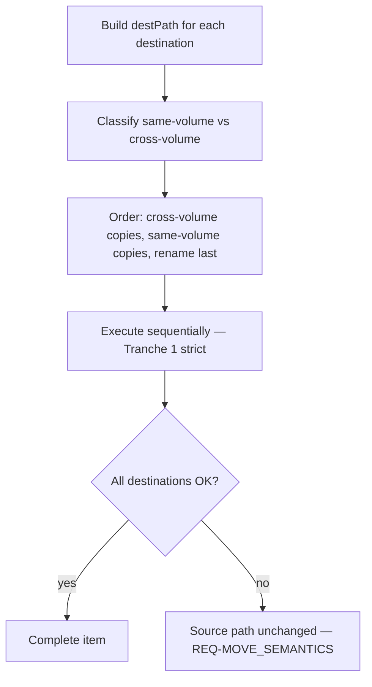

# NSYNC Hybrid Move Optimization — Control Plan

**Status:** Tranche 2 complete — Tranches 3–4 pending (refined 2026-09-01 post-build)  
**Methodology:** TIED 3.0.0  
**Request token:** `REQ-NSYNC_HYBRID_MOVE`  
**Related tokens (existing):** `[REQ-NSYNC_MULTI_TARGET]`, `[REQ-MOVE_SEMANTICS]`, `[REQ-FILE_OPERATIONS]`, `[REQ-VERIFY_DEST]`, `[REQ-COMPARE_METHODS]`, `[IMPL-NSYNC_ENGINE]`, `[IMPL-NSYNC_OPERATIONS]`, `[IMPL-FILES_DATA]`, `[ARCH-NSYNC_INTEGRATION]`, `[ARCH-FILESYSTEM_ABSTRACTION]`  
**Prior analysis:** Cross-volume move behavior trace (2026-09-01) — Move to All always copies per destination; bulk-move uses `fs.rename` / EXDEV fallback  
**Working folder:** `working/REQ-NSYNC_HYBRID_MOVE/`  
**CITDP (persisted):** `tied/citdp/CITDP-NSYNC_HYBRID_MOVE.yaml`  
**CITDP draft:** `working/REQ-NSYNC_HYBRID_MOVE/citdp-draft.yaml`  
**Checklist tracker:** `working/REQ-NSYNC_HYBRID_MOVE/checklist-tracker-NSYNC_HYBRID_MOVE.yaml`  
**Test strategy:** `working/REQ-NSYNC_HYBRID_MOVE/test-strategy-outline.md`

---

## Executive summary

**Problem:** **Move to All** (`sync-all`, `move: true`) always **copies** the source to every destination in parallel, then **deletes the source once** after all succeed. Even when a destination sits on the **same volume** as the source (where `fs.rename` would be instant), the engine still reads and writes the full file. With **verify** or **hash** compare enabled, the cost is worse: hash the source once, copy *N* times, optionally re-hash each destination.

**Goal:** Introduce a **hybrid move plan** that uses **rename (move) where the OS allows it** and **copy only where required**, while preserving **[REQ-MOVE_SEMANTICS]** (source content preserved at the original path until every destination succeeds).

**Non-goal:** Eliminate copy or verify when cross-volume destinations exist — cross-volume still requires byte transfer. This plan **reduces redundant I/O**, not remove correctness checks where they matter.

**Hard constraint:** **Move (`fs.rename`) may be used at most once per source item.** When the source volume is also the target volume for **more than one** destination, only **one** of those same-volume destinations may receive a rename; every other same-volume destination must use **copy**. A file cannot be renamed to two paths on the same drive.

**Canonical scenario (sponsor question):** Source on drive A; dest1 on drive A (different dir); dest2 on drive B.

| Phase | Operation | Reads | Notes |
|-------|-----------|-------|-------|
| 1 | Copy `source` → `dest2` (cross-volume) | 1× file | Source must remain until this succeeds |
| 2 | `rename(source → dest1)` (same-volume) | 0× (metadata) | Atomic; source path gone; file lives at dest1 |
| — | ~~Deferred delete~~ | — | **Not needed** — rename already removed source |

**Current cost (pre-Tranche-2):** 2× full read + 2× full write (+ optional 2× verify hash).  
**Optimized cost (Tranche 2 shipped):** 1× read + 1× write (cross-volume copy) + 1× rename for A+A+B mixes.  
**Remaining optimization (Tranches 3–4):** EXDEV-safe rename legs; skip redundant post-rename verify.

---

## A. Refine

### A.1 Scope and boundaries

**In scope**

- `[REQ-NSYNC_HYBRID_MOVE]` (new) — satisfaction criteria for hybrid planning and execution
- `[ARCH-NSYNC_MOVE_PLAN]` (new) — MovePlan, volume affinity, ordering, single-rename invariant
- `[IMPL-NSYNC_MOVE_PLAN]` (new) — pure `buildMovePlan()` module + unit tests
- Updates to `[IMPL-NSYNC_ENGINE]`, `[IMPL-NSYNC_OPERATIONS]` pseudo-code and code
- Optional shared move executor bridging `files.data.moveFile` EXDEV path
- `[PROC-VOCABULARY_INDEX]` — RECORD terms in `tied/vocab/nsync-multi-target.md`
- Unit tests in `src/lib/sync/`; integration tests with simulated `dev` / EXDEV
- CITDP + checklist tracker under `working/REQ-NSYNC_HYBRID_MOVE/`

**Out of scope** (separate CITDP required)

- Progress UI for long cross-volume copies
- Hard-link optimization (same-volume duplicate dests) — future tranche
- Automatic parallelization beyond cross-volume copy batching in Tranche 2b
- Mesh subsystem moves (`src/lib/mesh/`)
- Methodology YAML under `tied/methodology/`

**Unchanged behavior**

- **Copy to All** (`move: false`) — copy-only parallel sync
- **bulk-move** / single-destination **move** — still via `files.data.moveFile` (may share extracted module)
- **Partial failure** — source path must retain file until all destinations succeed
- **Store monitor**, **observer** callbacks, **cancel** semantics — same external contract
- Default **compareMethod** `size-mtime` skip logic — still evaluated per dest before each leg
- E2E Playwright unless composition tests cannot cover API wiring

### A.2 Proof labels

| Label | Meaning |
|---|---|
| observed (structural) | Validator result with tool provenance (`pseudocode_validate`, `tied_validate_consistency`) |
| observed (executable) | Vitest / `bunx tsc -b` with exit status and command provenance |
| recommended | Work defined here but not yet performed |
| residual risk | Limitation that remains after available evidence |

A passing full test suite does **not** prove hybrid move plans are optimal on every filesystem layout (bind mounts, exotic `dev` behavior).

### A.3 Baseline

#### A.3.1 Pre-change (observed 2026-09-01, Tranche 0)

| Path | API | Move primitive | Same-volume dest | Cross-volume dest | Source cleanup |
|------|-----|----------------|------------------|-------------------|----------------|
| **Move to All** | `sync-all`, `move: true` | `sync/operations.moveFile` → **copy only** | Copy | Copy | Deferred `deleteFile(source)` once |
| **Single pane move** | `bulk-move` / `move` | `files.data.moveFile` | **`fs.rename`** | **EXDEV → copy + delete** | Inline (rename or copy+delete) |

NSYNC **never** called `files.data.moveFile` and **never** attempted `fs.rename`. The EXDEV fix in `[CITDP-CROSS_VOLUME_MOVE_EXDEV]` explicitly left NSYNC unchanged — this change **supersedes** that non-goal by design.

#### A.3.2 Post–Tranche 2 (observed 2026-09-01)

| Path | API | Move primitive | Same-volume dest | Cross-volume dest | Source cleanup |
|------|-----|----------------|------------------|-------------------|----------------|
| **Move to All** | `sync-all`, `move: true` | `buildMovePlan` + `executeMovePlan` | **`renameFile`** (rename target) or copy (extra same-volume) | **`copyFile`** from source | Omit deferred delete when rename is final leg; else deferred `deleteFile` |
| **Single pane move** | `bulk-move` / `move` | `files.data.moveFile` | **`fs.rename`** | **EXDEV → copy + delete** | Unchanged |

**Shipped code (Tranche 2):**

- `src/lib/sync/move-plan.ts` — `buildMovePlan`, `classifyVolumeAffinity`
- `src/lib/sync/engine.ts` — `executeMovePlan`; hybrid path when `move: true`; parallel copy when `move: false`
- `src/lib/sync/operations.ts` — `renameFile` via `fs.rename` only (**no EXDEV fallback** — Tranche 3)
- `src/lib/sync/operations.ts` — `moveFile` still copy-only alias (unused by hybrid path)

**Not yet shipped:**

- Shared EXDEV executor between NSYNC and `files.data` (Tranche 3)
- EXDEV fallback on `sync/operations.renameFile` when `dev` match lies (Tranche 3, RISK-002)
- Post-rename verify skip (Tranche 4, RISK-004)
- Parallel cross-volume copy legs (Tranche 2b, optional)

### A.4 Desired behavior

When `move: true`, **SyncEngine** builds a per-item **MovePlan** before touching destinations:

1. **Classify** each `(source, destPath)` pair as **same-volume** or **cross-volume** via `Stats.dev`.
2. **Order operations** so the **original source path** still holds the file until all destinations succeed.
3. **Use rename** for **at most one** same-volume destination per item — the **rename target** (see § B.3). **Never** two rename/move legs on the same source volume.
4. **Use copy** for all cross-volume destinations and for **all other** same-volume destinations when the source drive is a target more than once.
5. **Delegate** cross-volume single-step moves to shared **`files.data.moveFile`** EXDEV implementation (or extracted shared module) — **Tranche 3 pending**
6. **Skip redundant verify** when an operation is an atomic same-volume rename (see § D) — **Tranche 4 pending**

### A.5 Tranche sizing and dependency order

| Order | Tranche | Rationale | Exit evidence |
|---|---|---|---|
| 0 | Documentation + CITDP + tracker | Planning gate before TDD | Control plan, persisted CITDP, `pre_implementation` gate allowed |
| 1 | `buildMovePlan` module (TDD, no engine wire) | Pure plan logic validated independently | `move-plan.test.ts` green; `pseudocode_validate` on `IMPL-NSYNC_MOVE_PLAN` |
| 2 | SyncEngine integration | Behavior change; depends on plan module | `engine.test.ts` mixed A+A+B; updated `MoveSemantics` pseudo-code | **Complete** |
| 2b | Parallel cross-volume copies (optional) | Performance; after sequential path proven | Benchmark or test asserting parallel cross-volume only | **Deferred** |
| 3 | Shared executor + EXDEV parity | DRY with `files.data`; RISK-002/006 | EXDEV tests + NSYNC `renameFile` fallback | **Next** |
| 4 | Verify-after-rename optimization | Correctness-sensitive skip; RISK-004 | Tests gate skip on same-volume rename only | **Pending** |

**Session budget:** One tranche per session; do **not** wire engine before MovePlan unit tests pass.

### A.6 Adversarial inquiry depth

| Field | Value |
|---|---|
| `depth_tier` | `minimal` |
| `gate_policy` | `advisory` |
| `assurance_profile` | `baseline-functional` + `data-integrity-migration` (filesystem safety) |
| `eligibility_triggers_matched` | `[]` — local filesystem optimization; no external-input/auth/network boundary |
| `integrated_waiver` | omitted — not required at minimal depth |
| `sub-adversarial-inquiry-pass` | `not_applicable` |

Upgrade to `integrated` only if implementation introduces new external-input surfaces or concurrent mutation paths not covered by existing `[REQ-MOVE_SEMANTICS]` tests.

---

## B. Plan — CITDP

Draft persisted at `tied/citdp/CITDP-NSYNC_HYBRID_MOVE.yaml`.  
Working copy: `working/REQ-NSYNC_HYBRID_MOVE/citdp-draft.yaml`.

### B.1 Change definition

| Field | Value |
|---|---|
| **Current (post–Tranche 2)** | Move to All builds per-item MovePlan; `executeMovePlan` runs legs sequentially; `omitDeferredDelete` when final leg is rename. `sync/operations.renameFile` uses `fs.rename` only (no EXDEV). Post-rename verify not optimized. |
| **Desired (full REQ)** | Above plus: shared EXDEV executor with `files.data.moveFile`; EXDEV fallback on rename legs; skip verify after atomic same-volume rename. |
| **Non-goals** | Progress UI; hard-link dedup; Copy to All changes; mesh moves; directory MovePlan (defer if NSYNC file-only) |
| **Success criteria (complete)** | `buildMovePlan` matrix; engine A+A+B; partial-failure source preserved; vocabulary RECORD; Tranche 2 verification gate |
| **Success criteria (remaining)** | Tranche 3: EXDEV fallback + shared executor. Tranche 4: verify skip on rename leg. Final consistency validation. |
| **Unchanged behavior** | Copy to All; bulk-move single dest; observer/cancel/store monitor; compare skip per dest |

### B.2 Impact analysis

**Modules / boundaries:** `src/lib/sync/` (engine, operations, new move-plan module); optional `src/lib/files.data.ts` or shared executor; `tied/vocab/nsync-multi-target.md`; project TIED YAML.

**TIED tokens affected:**

- `[REQ-NSYNC_MULTI_TARGET]`, `[REQ-MOVE_SEMANTICS]`, `[REQ-VERIFY_DEST]`, `[REQ-COMPARE_METHODS]`
- `[ARCH-NSYNC_INTEGRATION]`, `[ARCH-FILESYSTEM_ABSTRACTION]`
- `[IMPL-NSYNC_ENGINE]`, `[IMPL-NSYNC_OPERATIONS]`, `[IMPL-FILES_DATA]` (if shared executor)

**TIED tokens new:**

- `[REQ-NSYNC_HYBRID_MOVE]`, `[ARCH-NSYNC_MOVE_PLAN]`, `[IMPL-NSYNC_MOVE_PLAN]`

**Pseudo-code blocks (new / changed):**

| Block | IMPL | Action |
|---|---|---|
| `BUILD_MOVE_PLAN` | IMPL-NSYNC_MOVE_PLAN | **Done** — volume classify, order legs, single-rename invariant |
| `EXECUTE_MOVE_PLAN` | IMPL-NSYNC_ENGINE | **Done** — sequential leg executor |
| `MoveSemantics` | IMPL-NSYNC_ENGINE | **Done** — omit delete when plan ended in rename |
| `SyncItem` | IMPL-NSYNC_ENGINE | **Done** — hybrid path when `move: true` |
| `MoveFile` / `RenameFile` | IMPL-NSYNC_OPERATIONS | **Partial** — `renameFile` added; EXDEV + shared executor pending (Tranche 3) |
| `VERIFY_SKIP_RENAME` | IMPL-NSYNC_ENGINE | **Pending** — Tranche 4 |

### B.3 Architecture — hybrid move plan

#### B.3.1 Volume affinity (same-volume detection)

**Preferred:** compare `fs.stat(source).dev` with `fs.stat(path.dirname(destPath)).dev` (Unix/macOS; Node `Stats.dev`).

| Result | Classification | Operation candidates |
|--------|----------------|----------------------|
| Same `dev` | **same-volume** | `rename` (if rename target), else `copy` |
| Different `dev` | **cross-volume** | `copy` from `currentPath`, or `moveFile` with EXDEV when single dest |
| Stat fails | **unknown** | Treat as cross-volume (conservative) |

**No proactive `/Volumes/*` parsing.** `/Volumes/A` vs `/Volumes/B` differ by `dev` when on different mounts.

**Fallback:** if `rename` throws `EXDEV` despite matching `dev` (bind mounts, exotic layouts), retry that leg as copy+delete per `[IMPL-FILES_DATA]`.

#### B.3.2 Single-rename invariant

When **two or more destinations** resolve to the **same volume** as the source (`Stats.dev` match), the plan **must not** schedule more than **one** `rename` leg per item.

| Rule | Detail |
|------|--------|
| **At most one MOVE** | Per source path: `count(op === rename) ≤ 1` |
| **Why** | `fs.rename` relocates the inode; after rename the original source path no longer exists |
| **Same drive, 2+ targets** | One **rename target**; all other same-volume destinations are **copy** legs from `currentPath` before rename |
| **Forbidden** | Two rename legs to two folders on drive A when source is on drive A |

Implementation must assert in tests that multi same-volume destination plans never emit two rename legs.

#### B.3.3 MovePlan algorithm

**Ordering rule (safety):**

1. **Cross-volume copies** from `currentPath` (initially `source`).
2. **Same-volume copies** to all same-volume destinations **except** the **rename target**.
3. **Same-volume rename** `currentPath → renameTarget` (only if rename target exists and prior steps succeeded).

**Rename target selection:** among same-volume destinations, choose the **lexicographically smallest `destPath`** as the rename target. Rename is always the **final** leg — “last” means last in execution order, not arbitrary destination order.

**Why rename last:** If any earlier copy fails, the file remains at `source`. Satisfies **[REQ-MOVE_SEMANTICS]**.

**Parallelism:** Tranche 2 starts **strict sequential** execution. Tranche 2b may parallelize **cross-volume copy legs only** after plan is locked; rename and same-volume copies from `currentPath` remain sequential.

#### B.3.4 Destination mix matrix

| Same-volume dests | Cross-volume dests | Optimized sequence |
|-------------------|--------------------|--------------------|
| 0 | N | N copies from source + deferred delete (current behavior) |
| 1 | 0 | Single `rename` (equivalent to bulk-move) |
| 1 | M | M cross-volume copies, then rename to same-volume |
| K | 0 | K−1 same-volume copies, rename to rename target |
| K | M | M cross-volume copies + (K−1) same-volume **copies**, **one** same-volume **rename** |

**Example — source on A, dest1 and dest2 both on A, dest3 on B:** cross-volume copy to B first; **copy** source → dest2 (if dest1 is rename target per lex order, copy to dest2 first); **rename** source → dest1.

#### B.3.5 Deferred delete phase

| Condition | Delete phase |
|-----------|--------------|
| Final operation was **rename** | **Omit** — source already gone |
| All destinations **copy-only** | **Keep** current `sourcesToDelete` + `deleteFile(source)` |
| Mixed plan succeeded | **Omit** if rename was final leg; else delete |

Update **[IMPL-NSYNC_ENGINE] `MoveSemantics`** pseudo-code accordingly.

#### B.3.6 Unify move primitives

| Layer | Today | Target |
|-------|-------|--------|
| `files.data.ts` | `moveFile` rename + EXDEV | unchanged API; optional extract `shared/move-executor.ts` |
| `sync/operations.ts` | `moveFile` = copy | call shared executor for **single-leg** cross-volume; engine uses **MovePlan** for multi-dest |

### B.4 Risk analysis

| ID | Risk | Severity | Mitigation |
|----|------|----------|------------|
| RISK-001 | Rename-before-all-copies breaks **REQ-MOVE_SEMANTICS** | high | Rename last; copies first |
| RISK-002 | `dev` match but EXDEV on rename (bind mounts) | medium | Catch EXDEV; fallback to copy+delete for that leg |
| RISK-003 | Partial success after cross-volume copy but failed rename | medium | Source still intact; existing partial-failure semantics |
| RISK-004 | Verify skipped incorrectly after rename | medium | Gate skip on same-volume rename only; Tranche 4 tests |
| RISK-005 | Performance regression from sequential plan | low | Tranche 2b: parallel cross-volume copies only |
| RISK-006 | Divergence between NSYNC and `files.data` move | medium | Shared executor module; single EXDEV implementation |
| RISK-007 | Plan emits two rename legs when source drive has 2+ same-volume targets | high | § B.3.2 invariant; unit test `count(rename) === 1`; builder rejects invalid plans |

**Quality profile:** `data-integrity-migration` — filesystem move safety; falsification: partial failure leaves source intact; rename never runs before all required copies complete.

### B.5 Phased roadmap

See § C.1 for implementation tranche detail. CITDP `tdd_sequence` mirrors Tranche 1→4 order.

Open the tracker before Tranche 1 TDD begins (done at refine-plan).

---

## C. Implement

### C.1 Prioritized work (tranches)

#### Tranche 0 — Documentation and CITDP (this deliverable)

- [x] Control plan (this document)
- [x] Persist `tied/citdp/CITDP-NSYNC_HYBRID_MOVE.yaml`
- [x] Copy checklist tracker to `working/REQ-NSYNC_HYBRID_MOVE/`
- [x] Test strategy outline
- [x] Sponsor sign-off on ordering rules and failure semantics (2026-09-01)

#### Tranche 1 — Plan module (TDD, no engine wire yet)

- [x] Author `[REQ-NSYNC_HYBRID_MOVE]`, `[ARCH-NSYNC_MOVE_PLAN]`, `[IMPL-NSYNC_MOVE_PLAN]` via TIED MCP
- [x] `[IMPL-NSYNC_MOVE_PLAN]` pseudo-code + `gate-pseudocode-validation`
- [x] RED/GREEN: `src/lib/sync/move-plan.test.ts` — matrix § B.3.4; single-rename invariant
- [x] `buildMovePlan(source, destPaths[])` in `src/lib/sync/move-plan.ts`
- [x] `pseudocode_validate` + `tied_validate_consistency`

**Checklist entry:** `author-requirement` → `author-architecture` → `resolve-pseudocode` → `unit-test-red` → `unit-test-green`

#### Tranche 2 — Engine integration ✅

- [x] RED: `engine.test.ts` — mixed A+A+B asserts **rename** once, **one** cross-volume copy, **no** deferred delete
- [x] Update `SyncItem` / add `EXECUTE_MOVE_PLAN` when `move: true`
- [x] Replace parallel `Promise.all` move path with plan executor (strict sequential)
- [x] LEAP: `IMPL-NSYNC_ENGINE-pseudocode.md`
- [x] Verification gate: `gate-verification-tranche2.json`

**Checklist entry:** `unit-test-red` → `unit-test-green` → `three-way-alignment-unit` → `composition-integration`

#### Tranche 2b — Parallel cross-volume copies (optional, deferred)

Parallelize cross-volume legs only; same-volume and rename remain sequential. **Sponsor opt-in** — not required for REQ close-out.

#### Tranche 3 — Shared executor + EXDEV parity **(next session)**

**Problem:** `sync/operations.renameFile` calls `fs.rename` directly. Bind mounts and exotic layouts can throw EXDEV despite matching `Stats.dev` (RISK-002). NSYNC and `files.data.moveFile` duplicate move logic (RISK-006).

**Approach (recommended):**

1. Extract shared module `src/lib/move-executor.ts` (or equivalent) from `files.data.moveFile`:
   - `renameOrMove(src, dest)` — try `fs.rename`; on EXDEV → `copyFile` + `deleteFile(src)`
   - Single `isExdevError` helper (already in `files.data.ts`)
2. `files.data.moveFile` delegates to shared module (behavior unchanged)
3. `sync/operations.renameFile` delegates to shared module
4. **Do not** route multi-dest hybrid plans through `moveFile` inline delete — engine MovePlan owns ordering and `omitDeferredDelete`

**Tests (RED before code):**

| Test | File | Assert |
|------|------|--------|
| EXDEV on rename despite dev match | `engine.test.ts` or new `operations.test.ts` | Leg falls back to copy; source preserved until plan completes |
| Existing bulk-move EXDEV | `copy-file.data.test.ts` | Unchanged pass |
| Existing files.data move | `files.data.test.ts` | Unchanged pass |

**Exit evidence:** All Tranche 3 tests green; `pseudocode_validate` on `IMPL-NSYNC_OPERATIONS`; CITDP evidence updated.

#### Tranche 4 — Verify optimization **(after Tranche 3)**

**Problem:** `executeMovePlan` runs `verifyDestination` after every non-skipped leg when `verify: true`. Same-volume rename is inode-preserving — post-rename hash verify is redundant (§ D).

1. RED: rename leg + `verify: true` → `verifyDestination` **not** called
2. RED: cross-volume copy + `verify: true` → verify **still** called
3. GREEN: skip in `executeMovePlan` when `leg.op === 'rename'`; log `DIAGNOSTIC: skip verify after atomic rename`
4. LEAP: `[REQ-VERIFY_DEST]` traceability note

**Exit evidence:** Tranche 4 unit tests; full proof command suite (§ C.3); verification gate; REQ close-out eligible.

### C.2 Session bootstrap (every implementation session)

1. Call `tied_config_get_base_path` — confirm `/…/panorama/tied`.
2. PRELOAD `tied/vocab/nsync-multi-target.md`, `tied/vocab/file-marking.md`.
3. Read this plan + `tied/docs/agent-req-implementation-checklist.md`.
4. Keep `tied/methodology/` read-only; write only project-owned TIED YAML.
5. Tranche order § C.1 — **do not** wire engine before MovePlan tests pass.
6. RED unit tests before production code; composition tests before API wiring changes.
7. Run scoped Vitest, `bunx tsc -b`, `tied_validate_consistency` after changes.
8. `[PROC-LEAP]` after code: IMPL → ARCH → REQ → vocab.

### C.3 Completion checklist (per tranche)

- [ ] IMPL pseudo-code updated with token comments per `[PROC-IMPL_PSEUDOCODE_TOKENS]`
- [ ] `pseudocode_validate` pass on touched IMPL tokens
- [ ] Unit tests RED then GREEN for tranche scope
- [ ] `bunx tsc -b` and scoped Vitest exit 0
- [ ] `tied_validate_consistency` pass after TIED YAML writes
- [ ] Vocabulary RECORD in `tied/vocab/nsync-multi-target.md`
- [ ] CITDP `evidence.commands` updated with exit codes
- [ ] Module validation documented under `[REQ-MODULE_VALIDATION]`

### C.4 Loop-back rules

Scope, depth, or gate-policy changes invalidate downstream Tracker dispositions and evidence; re-run the applicable gate before continuing. Do not carry verification evidence across a loop-back without fresh collection.

---

## D. Verification and compare optimization

### D.1 Problem

With `verify: true` or `compareMethod: hash`, the engine may **hash the source once** and **verify each destination** after copy. Rename legs do not need post-rename hash verify if pre-rename compare already decided the dest needed updating and rename is same-volume atomic (content identical by inode move).

### D.2 Rules (proposed)

| Operation | compare skip before | verify after |
|-----------|-------------------|--------------|
| Cross-volume copy | Yes (existing) | Yes if `verify` enabled |
| Same-volume copy (non-final) | Yes | Yes if `verify` enabled |
| Same-volume rename (final) | Yes | **Skip** — log `DIAGNOSTIC: skip verify after atomic rename` |

### D.3 Hash compare method

When `compareMethod: hash`, source hash computed **once** per item. Cross-volume copies benefit most. Rename-last leg uses hash only in **compare** phase, not re-verify.

---

## E. TIED stack — tokens to add (implementation phase)

| Token | Type | Purpose |
|-------|------|---------|
| `REQ-NSYNC_HYBRID_MOVE` | REQ | Hybrid move plan requirement |
| `ARCH-NSYNC_MOVE_PLAN` | ARCH | Volume affinity + ordering architecture |
| `IMPL-NSYNC_MOVE_PLAN` | IMPL | Pure `buildMovePlan()` module |
| `IMPL-NSYNC_ENGINE` | IMPL | Integrate plan into `syncItem` |
| `IMPL-NSYNC_OPERATIONS` | IMPL | Delegate to shared move/copy executor |

Update `tied/semantic-tokens.yaml` when implementation starts (Tranche 1).

---

## F. Gate status

| Phase | Date | Result | Receipt |
|---|---|---|---|
| `pre_implementation` | 2026-09-01 (refine-plan) | `allowed: true`, `depth: minimal` | `gate-pre_implementation-refine-plan.json` |
| `verification` | 2026-09-01 (Tranche 1) | `allowed: true`, `depth: minimal` | `gate-verification-tranche1.json` |
| `verification` | 2026-09-01 (Tranche 2) | `allowed: true`, `depth: minimal` | `gate-verification-tranche2.json` |
| `pre_implementation` | 2026-09-01 (Tranche 3 refine) | `allowed: true`, `depth: minimal` | `gate-pre_implementation-tranche3.json` |

Tranches 1–2 checklist steps completed. Tracker reset for Tranche 3 (`unit-test-red` through `verification-gate` pending). `sub-adversarial-inquiry-pass`: `not_applicable` at minimal depth.

---

## G. Vocabulary (RECORD at implementation)

**Tranche 1–2 terms recorded** in `tied/vocab/nsync-multi-target.md` (2026-09-01).

| Preferred term | Meaning |
|----------------|---------|
| **Hybrid move plan** | Ordered per-item legs mixing rename and copy |
| **Volume affinity** | same-volume vs cross-volume from `Stats.dev` |
| **Rename target** | The **one** same-volume destination receiving `fs.rename` (lexicographically smallest `destPath` among same-volume dests) |
| **Single-rename invariant** | When source volume matches multiple targets, at most one MOVE leg; others COPY |
| **Move leg** | One copy or rename step in the plan |
| **currentPath** | Path read for the next leg; starts at source; unchanged until rename removes source |

---

## I. Remaining work summary

| Item | Owner tranche | Blocks close-out? |
|------|---------------|-------------------|
| EXDEV fallback on NSYNC rename legs | 3 | Yes (RISK-002) |
| Shared move executor with `files.data` | 3 | Yes (RISK-006) |
| Post-rename verify skip | 4 | No (perf/correctness already OK; REQ polish) |
| Parallel cross-volume copies | 2b | No (optional) |

**Close-out path:** Tranche 3 verification gate → Tranche 4 verification gate → `plan-close-out` with full proof suite. See `working/REQ-NSYNC_HYBRID_MOVE/pending-work.md` for session-ready next actions.

---

## H. References

| Artifact | Path |
|----------|------|
| NSYNC engine | `src/lib/sync/engine.ts` |
| NSYNC operations | `src/lib/sync/operations.ts` |
| Files data move | `src/lib/files.data.ts` |
| Engine pseudo-code | `tied/implementation-decisions/IMPL-NSYNC_ENGINE-pseudocode.md` |
| Prior EXDEV CITDP | `tied/citdp/CITDP-CROSS_VOLUME_MOVE_EXDEV.yaml` |
| Move semantics REQ | `tied/requirements/REQ-MOVE_SEMANTICS.yaml` |
| Plan template (charter) | `docs/tied-3.0-alignment-sync-plan.md` |
| Test strategy | `working/REQ-NSYNC_HYBRID_MOVE/test-strategy-outline.md` |

---

*Document version:* 3.0  
*Created:* 2026-09-01  
*Refined:* 2026-09-01 — post–Tranche 2; remaining Tranches 3–4 specified; tracker reset for Tranche 3  
*Author:* AI Agent (refine-plan)
