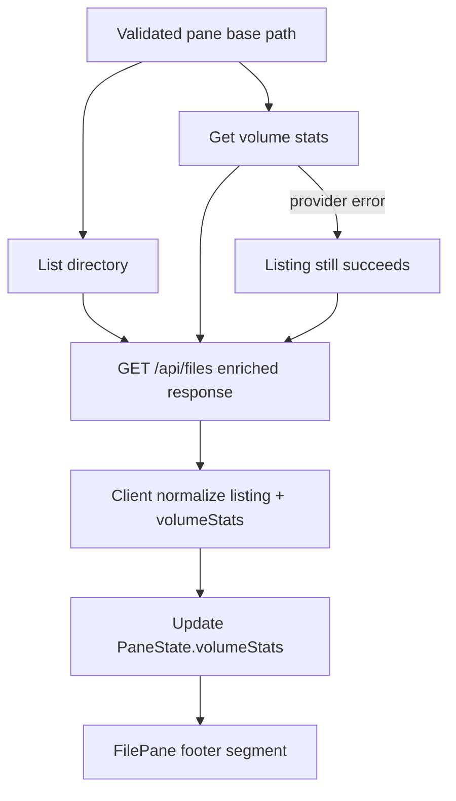

# Per-Pane Volume Capacity Display — Control Plan

**Status:** Implemented and verified (2026-09-01)  
**Methodology:** TIED 3.0.0  
**Request token:** `REQ-PANE_VOLUME_CAPACITY`  
**Product vocabulary:** **Workspace**, **Pane**, **Pane state**, **Pane header**, and **Pane footer** follow [`tied/vocab/workspace-pane.md`](../tied/vocab/workspace-pane.md).  
**Existing traceability:** `[REQ-FILE_MANAGER_PAGE]`, `[REQ-MULTI_PANE_LAYOUT]`, `[REQ-DIRECTORY_NAVIGATION]`, `[REQ-FILE_LISTING]`, `[ARCH-FILE_MANAGER_HIERARCHY]`, `[ARCH-FILESYSTEM_ABSTRACTION]`, `[ARCH-SERVER_CLIENT_BOUNDARY]`, `[IMPL-FILES_DATA]`, `[IMPL-FILES_API]`, `[IMPL-FILE_PANE]`, `[IMPL-WORKSPACE_VIEW]`  
**Tokens to register at implementation kickoff:** `[REQ-PANE_VOLUME_CAPACITY]`, `[ARCH-PANE_VOLUME_CAPACITY]`, `[IMPL-PANE_VOLUME_CAPACITY]`  
**Working folder:** `working/REQ-PANE_VOLUME_CAPACITY/`  
**CITDP (draft):** `working/REQ-PANE_VOLUME_CAPACITY/citdp-draft.yaml`  
**Checklist tracker:** `working/REQ-PANE_VOLUME_CAPACITY/checklist-tracker-PANE_VOLUME_CAPACITY.yaml`  
**Test strategy:** `working/REQ-PANE_VOLUME_CAPACITY/test-strategy-outline.md`

---

## Executive summary

Add a compact, per-pane **volume capacity** indicator showing total volume size, **available space** (bytes and percentage), and optionally used percentage when it improves comprehension. Stats are derived from the filesystem volume containing each pane’s **base directory**, fetched on the server, returned through the existing directory-listing boundary, stored in **Pane state**, and rendered in each `FilePane` footer.

The feature is practical because filesystem access is already server-only and panes already refresh via `fetchDirectoryListing()` on navigation and reload. The primary design constraints:

1. A directory path is not a volume identity — the server must query filesystem statistics for the path and treat the returned device/volume as source of truth.
2. **Listing hydration is split today** — server SSR bootstrap uses `listDirectory()` directly while client navigation uses `GET /api/files`; capacity must be wired through **both** paths or filled in on first client mount.
3. **Legacy GET response shape** — without `displaySpecId`, `GET /api/files` currently returns a bare `FileStat[]` array; v1 must unify to an enriched object so `volumeStats` is always available to panes.

**Goful parity note:** Goful’s `[REQ-FILE_INFO_BAR]` uses a **single workspace-wide** status bar (focused file + mount stats via `syscall.Statfs`). Panorama intentionally shows **per-pane** capacity because multi-pane cross-volume comparison is a core product differentiator.

**First-release decisions (resolved):**

| Decision | Resolution |
|---|---|
| Free space semantics | User-available bytes via `bavail`, not raw free blocks |
| Total size visibility | Shown in compact footer; full values in `aria-label` / tooltip |
| Feature default | Enabled in v1; no `files.yaml` toggle in first release |
| Low-space warning | Deferred — no threshold until product selects one |
| Windows / non-Unix | Return `status: "unsupported"`; never fabricate zeros |
| `deviceId` | Internal cache/diagnostic metadata only; not user-facing |
| Numeric contract | JavaScript `number` with documented safe-range policy and large-volume tests |
| Dedicated volume API | Out of scope for v1 — enrich existing `/api/files` listing response |
| GET response shape | **Always return enriched object** `{ files, volumeStats, … }`; migrate array consumers in-repo |
| Mesh snapshot persistence | **Do not** store `volumeStats` in workspace snapshot — ephemeral session metadata |
| Provider module location | New server-only `src/lib/volume-stats.ts`; route and SSR bootstrap import it |

---

## A. Refine

### A.1 Scope and boundaries

**In scope**

- Server-only volume-statistics provider (`fs.promises.statfs` where available)
- Typed API extension on directory listing (`volumeStats`)
- Per-pane state for latest capacity result
- Capacity refresh on initial listing, navigation, manual refresh, post-operation listing refresh
- **Client mount hydration** for SSR/mesh-bootstrap panes that start without stats
- Compact footer rendering with accessible full-value label
- Human-readable bytes via existing client-safe `formatSize()`
- Graceful unavailable/unsupported behavior (listing never fails because of capacity)
- In-repo migration of bare-array `GET /api/files` consumers (`listDirectoryViaFilesApi`, tests)
- Unit, API contract, composition, and component tests
- TIED REQ/ARCH/IMPL records and vocabulary RECORD before RED tests

**Out of scope**

- Filesystem-wide monitoring or notifications
- Pre-operation fit prediction or quotas
- Per-directory disk usage totals; inode counts
- Replacing NSYNC volume-affinity classification (`Stats.dev` in `move-plan.ts`)
- Global storage dashboard; hard-link/dedup optimization
- Dedicated `/api/files/volume` endpoint in v1
- Polling during long-running operations
- `files.yaml` `display.volumeStats` toggle in v1
- Low-space warning threshold styling in v1
- Persisting capacity in **Workspace snapshot** v1–v5

**Unchanged behavior**

- Directory listing, display filters, cross-pane visibility, NSYNC, mesh bridge snapshot schema
- Path validation and traversal rejection before filesystem access
- POST `/api/files` operations contract

### A.2 Proof labels

| Label | Meaning |
|---|---|
| observed (structural) | `pseudocode_validate`, `tied_validate_consistency`, `lint_yaml` |
| observed (executable) | Vitest / `bunx tsc -b` with exit status |
| recommended | Work defined here but not yet performed |
| residual risk | Limitation after available evidence (e.g. network-mount statfs latency, SSR flash without stats) |

### A.3 Baseline (planning)

| Layer | Extension point | Role |
|---|---|---|
| Server provider | `src/lib/volume-stats.ts` (implemented) | Pure statfs → `VolumeStats` normalization |
| Server data | `src/lib/files.data.ts` | May re-export provider; remains listing/mutation layer |
| HTTP | `src/app/api/files/route.ts` (implemented) | Directory listing response owner; GET now always returns enriched object |
| SSR bootstrap | `src/app/files/page.tsx` | Server `listDirectory` for initial panes — add parallel `getVolumeStats` |
| Mesh restore | `src/lib/workspace-mesh-bridge.ts` (implemented) | `listDirectoryViaFilesApi` parses `body.files` from enriched GET response |
| Client fetch | `src/lib/pane-display-filter.ts` | Listing fetch contract + normalization |
| Orchestration | `src/app/files/WorkspaceView.tsx` | `PaneState` boundary + mount hydration |
| Presentation | `src/app/files/components/FilePane.tsx` | Footer chrome; update visibility predicate |
| Formatting | `src/lib/files.utils.ts` | Client-safe `formatSize()` |
| Volume affinity (NSYNC) | `src/lib/sync/move-plan.ts` | Uses `Stats.dev` — operation-specific; not capacity contract |

`fs.promises.statfs(path)` is available in the current Node runtime on macOS (development target).

**Current API shape (observed after Tranche 2):** `GET /api/files` always returns `{ files, volumeStats, hiddenCount, totalCount }`; direct consumers in `WorkspaceView.tsx` still need migration to the enriched shape.

**Current footer visibility (observed):** `FilePane` renders footer only when `files.length > 0 || marks.size > 0 || hiddenCount > 0`. Empty directories therefore hide footer today — capacity display requires predicate change (RISK-005).

### A.4 Desired behavior



1. API receives validated directory path and lists directory.
2. Server calls `getVolumeStats(dirPath)` and attaches normalized `volumeStats`.
3. GET **always** returns `{ files, volumeStats, … }` (never bare array in v1).
4. Client normalizes response; legacy-array handling removed from fetch path after migration.
5. `WorkspaceView` stores result on affected **Pane state**.
6. On mount, panes missing stats trigger one listing fetch or dedicated stats attach from SSR props.
7. `FilePane` renders footer capacity segment with explicit status variants.

Capacity failure is isolated — files still list. Navigation and refresh replace stats for the current volume.

### A.5 Hydration paths (must all reach pane footer)

| Path | Today | v1 target |
|---|---|---|
| Default SSR startup (`page.tsx`) | `listDirectory` only | Attach `volumeStats` via provider during server bootstrap **or** client mount backfill |
| Mesh server restore (`buildWorkspaceRestoreBundle` + `listDirectory`) | Server `listDirectory` only | Same as SSR — provider on bootstrap |
| Client mesh rehydrate (`listDirectoryViaFilesApi`) | Parses bare array from GET | Parse `{ files, volumeStats }` |
| `fetchDirectoryListing` / `handleNavigate` | Wrapped or legacy array | Always enriched object |
| Pane refresh (`pane.refresh`) | Reuses `handleNavigate` | Inherits enriched listing |
| Post bulk-op refresh | `handleNavigate` on affected panes | Inherits enriched listing |

**Recommended v1 approach:** unify GET response + add `getVolumeStats` call in SSR bootstrap (`page.tsx` and mesh bundle server path) so first paint has stats; client mount effect backfills any pane still missing stats (mesh client rehydrate edge).

### A.6 Module tranches and dependency order

| Order | Tranche | Module | Exit evidence |
|---|---|---|---|
| 0 | Planning + TIED | REQ/ARCH/IMPL + pseudo-code | `pre_implementation` gate; pseudo-code catalog |
| 1 | Provider RED/GREEN | A — `volume-stats.ts` | **Complete:** 11 provider tests green; TypeScript clean |
| 2 | API RED/GREEN | B — Listing API contract + GET shape migration | **Complete:** 51 scoped tests green; mesh bridge migrated; direct WorkspaceView consumers remain |
| 3 | Normalization RED/GREEN | C — Client listing normalization | Normalization unit tests green |
| 4 | State RED/GREEN | D — Pane state + SSR/mesh hydration | Workspace composition tests green |
| 5 | UI RED/GREEN | E — Pane capacity presentation | FilePane component tests green |

**Session budget:** One module tranche per session; validate each module before integrating downstream.

### A.7 Adversarial inquiry depth

| Field | Value |
|---|---|
| `depth_tier` | `minimal` |
| `gate_policy` | `advisory` |
| `assurance_profile` | `baseline-functional` — informational UI; no auth or persistence |
| `eligibility_triggers_matched` | `[]` — extends existing listing API; local statfs; no new auth or persistence |
| `integrated_waiver` | omitted |
| `sub-adversarial-inquiry-pass` | `not_applicable` |

Upgrade to `integrated` only if implementation introduces new unvalidated external-input surfaces beyond existing path validation.

### A.8 Vocabulary RECORD (at `sub-vocabulary-sync`)

Add to `tied/vocab/workspace-pane.md`:

| Preferred term | Definition |
|---|---|
| **Volume capacity** | Total byte capacity of the filesystem volume containing a pane base path |
| **Available space** | Bytes available to the user (`bavail`-based where platform exposes it) |
| **Free-space percentage** | Available bytes ÷ total bytes, 0–100 |
| **Volume stats** | API object: capacity values + `status` + optional diagnostic fields |
| **Capacity unavailable** | Non-success state when server cannot obtain trustworthy stats |
| **Capacity refresh** | Re-read stats on pane init, navigation, manual refresh, post-op listing refresh |

Do not use “disk usage” interchangeably with “volume capacity” for mount-level metrics.

---

## B. Plan — CITDP

Draft: `working/REQ-PANE_VOLUME_CAPACITY/citdp-draft.yaml`. Persist to `tied/citdp/CITDP-PANE_VOLUME_CAPACITY.yaml` after implementation.

### B.1 Change definition

| Field | Value |
|---|---|
| **Current** | Panes show listing and footer cursor/sort/mark metadata only; no volume capacity. GET without `displaySpecId` returns bare `FileStat[]`. SSR bootstrap has no statfs path. |
| **Desired** | GET always returns enriched listing with `volumeStats`; each pane stores and displays capacity in footer; SSR/mesh bootstrap and client navigation both hydrate stats. |
| **Non-goals** | See § A.1 out of scope |
| **Success criteria** | See § 15 acceptance checklist |
| **Unchanged behavior** | Listing semantics, filters, NSYNC volume affinity, mesh snapshot fields, bulk ops |

### B.2 Impact analysis

**Modules / boundaries:** `src/lib/volume-stats.ts` (new); `src/lib/files.data.ts`; `src/app/api/files/route.ts`; `src/app/files/page.tsx`; `src/lib/workspace-mesh-bridge.ts`; `src/lib/pane-display-filter.ts`; `WorkspaceView.tsx`; `FilePane.tsx`; `tied/vocab/workspace-pane.md`; project TIED YAML.

**TIED tokens affected (existing):** `[REQ-FILE_LISTING]`, `[REQ-MULTI_PANE_LAYOUT]`, `[REQ-DIRECTORY_NAVIGATION]`, `[REQ-FILE_MANAGER_PAGE]`, `[REQ-WORKSPACE_MESH_BRIDGE]`, `[ARCH-FILESYSTEM_ABSTRACTION]`, `[ARCH-SERVER_CLIENT_BOUNDARY]`, `[ARCH-WORKSPACE_MESH_BRIDGE]`, `[IMPL-FILES_DATA]`, `[IMPL-FILES_API]`, `[IMPL-FILE_MANAGER_PAGE]`, `[IMPL-WORKSPACE_MESH_BRIDGE]`, `[IMPL-WORKSPACE_VIEW]`, `[IMPL-FILE_PANE]`

**TIED tokens new:** `[REQ-PANE_VOLUME_CAPACITY]`, `[ARCH-PANE_VOLUME_CAPACITY]`, `[IMPL-PANE_VOLUME_CAPACITY]`

**Pseudo-code blocks (new / changed):**

| Block | IMPL | Action |
|---|---|---|
| `GET_VOLUME_STATS` | IMPL-PANE_VOLUME_CAPACITY | **New** — server path → normalized stats |
| `NORMALIZE_VOLUME_STATS` | IMPL-PANE_VOLUME_CAPACITY | **New** — raw statfs → contract |
| `ENRICH_DIRECTORY_LISTING` | IMPL-FILES_API, IMPL-PANE_VOLUME_CAPACITY | **Change** — attach stats; unify GET shape |
| `NORMALIZE_LISTING_RESPONSE` | IMPL-PANE_VOLUME_CAPACITY | **New** — client unified response |
| `UPDATE_PANE_VOLUME_STATS` | IMPL-WORKSPACE_VIEW | **Change** — pane state + mount backfill |
| `RENDER_PANE_VOLUME_STATS` | IMPL-FILE_PANE | **New** — footer presentation |
| `SSR_ATTACH_VOLUME_STATS` | IMPL-FILE_MANAGER_PAGE | **New** — server bootstrap hydration |

### B.3 Architecture — listing enrichment

#### B.3.1 GET response unification (breaking in-repo only)

**Today:**

| Query | Response shape |
|---|---|
| `?path=…` (no `displaySpecId`) | `FileStat[]` bare array |
| `?path=…&displaySpecId=…` | `{ files, hiddenCount, totalCount }` |

**v1 target (both cases):**

```text
{
  files: FileStat[]
  volumeStats: VolumeStats
  hiddenCount?: number      // 0 when no display filter
  totalCount?: number       // files.length or raw count when filtered
}
```

**Migration scope (in-repo):**

- `src/lib/workspace-mesh-bridge.ts` — `listDirectoryViaFilesApi` reads `body.files`
- `src/lib/pane-display-filter.ts` — remove bare-array branch after migration
- `src/app/api/files/display-filter.route.test.ts` — extend expectations
- Any test fixtures casting GET response as array

External API consumers outside this repo are not a stated concern; document the shape change in IMPL `implementation_approach.details`.

#### B.3.2 Provider module

Place normalization in **`src/lib/volume-stats.ts`** (server-only; no `"use client"` imports):

```text
getVolumeStats(sourcePath: string): Promise<VolumeStats>
normalizeVolumeStats(raw, sourcePath): VolumeStats
```

`files.data.ts` may re-export for convenience but must not pull React or client modules.

#### B.3.3 Pane state field

Extend **Pane state** (not mesh snapshot) with:

```text
volumeStats: VolumeStats | null   // null until first successful hydration
```

Do not add to `PaneInitialState` unless SSR bootstrap passes stats through props; prefer optional `volumeStats?` on initial pane payload from server.

### B.4 Risk analysis

| ID | Risk | Severity | Mitigation |
|---|---|---|---|
| RISK-001 | `statfs` slow on network mounts | medium | Non-fatal capacity failure; optional timeout in later tranche |
| RISK-002 | Large counters lose precision | medium | Explicit numeric contract; large-volume unit tests |
| RISK-003 | Async navigation races | medium | Same request-ordering guard as listing state |
| RISK-004 | Unavailable stats appear as zero | high | Explicit `available` / `unavailable` / `unsupported` statuses |
| RISK-005 | Empty-directory footer hides capacity | medium | Include capacity in footer visibility predicate |
| RISK-006 | Footer crowding | low | Responsive compact format; independent truncation |
| RISK-007 | Repeated statfs for same mount | low | Request-local dedup only if profiling proves need |
| RISK-008 | Path/error leakage in diagnostics | medium | Return requested path context only; no raw FS errors to client |
| RISK-009 | SSR panes lack stats until client fetch | low | SSR attach + mount backfill; brief empty/unavailable state acceptable |
| RISK-010 | GET shape migration breaks mesh rehydrate | high | Update `listDirectoryViaFilesApi` in same tranche as route change |

**Quality profile:** `baseline-functional` — stats are informational only; falsification: listing and file ops succeed when capacity provider fails; UI never blocks navigation on statfs errors.

### B.5 Test strategy

Full matrix: `working/REQ-PANE_VOLUME_CAPACITY/test-strategy-outline.md`.

**E2E policy:** `not_applicable` unless component tests cannot prove responsive truncation or browser a11y — document justification if added.

---

## C. Implement — technical specification

### C.1 Prioritized work (tranches)

#### Tranche 0 — Documentation and CITDP (complete)

- [x] Control plan (this document)
- [x] CITDP draft + checklist tracker + test strategy outline
- [x] `pre_implementation` gate (refine-plan)
- [x] Sponsor sign-off on GET shape unification and SSR hydration approach (plan decisions accepted)

#### Tranche 1 — Provider module (TDD, complete)

- [x] Author `[REQ-PANE_VOLUME_CAPACITY]`, `[ARCH-PANE_VOLUME_CAPACITY]`, `[IMPL-PANE_VOLUME_CAPACITY]` via TIED MCP
- [x] `[IMPL-PANE_VOLUME_CAPACITY]` pseudo-code + `gate-pseudocode-validation`
- [x] RED/GREEN: `src/lib/volume-stats.test.ts`
- [x] `getVolumeStats` / `normalizeVolumeStats` in `src/lib/volume-stats.ts`

#### Tranche 2 — API contract + GET migration (complete)

- [x] RED: route tests for enriched response with and without `displaySpecId`
- [x] GREEN: `GET` always returns object with `files` + `volumeStats`
- [x] Listing succeeds when provider returns unavailable
- [x] Update `listDirectoryViaFilesApi` to parse `.files`
- [ ] Migrate direct `WorkspaceView.tsx` GET consumers (scheduled in Tranche 3/4)

#### Tranche 3 — Client normalization (complete)

- [x] RED/GREEN: `pane-display-filter` tests for unified response
- [x] Normalize enriched responses and malformed stats
- [x] Migrate remaining direct `WorkspaceView.tsx` GET consumers to the enriched response

#### Tranche 4 — Pane state + hydration (complete)

- [x] RED/GREEN: WorkspaceView composition coverage
- [x] SSR attach in `page.tsx` and mesh restore bootstrap
- [x] Mount backfill for panes without volume stats
- [x] Listing updates replace stats for the affected pane

#### Tranche 5 — FilePane presentation (complete)

- [x] RED/GREEN: FilePane footer states, empty directory, a11y, test IDs
- [x] Footer visibility predicate includes capacity segment

#### Close-out

- [ ] Full scoped Vitest + `bunx tsc -b` + `validate:vocabulary`
- [ ] `pseudocode_validate` + `tied_validate_consistency`
- [ ] Persist `tied/citdp/CITDP-PANE_VOLUME_CAPACITY.yaml`
- [ ] Verification gate + optional README note (informational stats only)

### C.2 Data contract

```text
VolumeStats:
  totalBytes: integer
  availableBytes: integer
  freePercent: number
  deviceId: integer | string | null    # internal only
  sourcePath: string
  status: "available" | "unavailable" | "unsupported"
  errorCode?: "STAT_FAILED" | "INVALID_STATS" | "UNSUPPORTED"
```

```text
DirectoryListingResponse:
  files: FileStat[]
  hiddenCount: integer
  totalCount: integer
  volumeStats: VolumeStats
```

**Invariants:** `totalBytes >= 0`; `availableBytes >= 0`; `availableBytes <= totalBytes` when consistent; `freePercent` clamped `[0, 100]`; no division by zero; failure does not fail listing.

### C.3 Filesystem calculation

**Unix-like:** `fs.promises.statfs(dirPath)`

```text
blockSize := statfs.bsize or statfs.frsize
totalBytes := statfs.blocks * blockSize
availableBytes := statfs.bavail * blockSize
freePercent := (availableBytes / totalBytes) * 100
```

**Windows / other:** Return `status: "unsupported"` — do not silently report zeros.

### C.4 Caching and refresh

- No long-lived client cache in v1
- Fetch capacity with each listing request; store latest per pane
- Server request-local dedup by `deviceId` only if profiling proves need
- Refresh: pane init, navigation, manual refresh, post-operation listing refresh, mount backfill
- Do not refresh on cursor, mark, sort, or display-filter-only changes unless they trigger a new listing fetch

### C.5 UI/UX

**Placement:** Pane footer (secondary status segment alongside cursor/sort/mark).

**Compact format:** `Free 412 GB (41.4%) · Total 1.0 TB`  
**Narrow:** `412 GB free · 41.4%`  
**Accessible label:** `Available: 412 GB of 1.0 TB (41.4%)` + volume path context

**States:** available (muted); unavailable (`Storage: unavailable`); unsupported (`Storage: unsupported` or omit with tooltip); low-space warning deferred.

**Test IDs:** `pane-volume-stats`, `pane-volume-stats-unavailable`

### C.6 IMPL pseudo-code blocks (catalog)

Sidecar: `tied/implementation-decisions/IMPL-PANE_VOLUME_CAPACITY-pseudocode.md`

| Block | Responsibility |
|---|---|
| `GET_VOLUME_STATS` | Server path → normalized stats |
| `NORMALIZE_VOLUME_STATS` | Raw statfs → contract + status |
| `ENRICH_DIRECTORY_LISTING` | Route attaches stats; unified GET object |
| `SSR_ATTACH_VOLUME_STATS` | Server page bootstrap attaches stats to initial panes |
| `NORMALIZE_LISTING_RESPONSE` | Client unified response handling |
| `UPDATE_PANE_VOLUME_STATS` | WorkspaceView pane state + mount backfill |
| `RENDER_PANE_VOLUME_STATS` | FilePane footer presentation |

Each active procedure block: token comments naming REQ/ARCH/IMPL; `INPUT`, `OUTPUT`, `PRE`, `POST`, `EFFECTS`, `FAILURE_MODES`, `DATA_TRANSITION`, `TERMINATION` as applicable.

---

## 15. Acceptance checklist

### Product behavior

- [ ] Each pane displays volume total, available amount, and available percentage when supported
- [ ] Different volumes show different values; listing succeeds when capacity collection fails
- [ ] Empty directories can display capacity
- [ ] Capacity failure does not hide or break file listings
- [ ] Display is readable in tile, one-row, one-column, and fullscreen layouts
- [ ] Existing pane footer information remains intact
- [ ] Stats are informational only — copy/move do not gate on displayed capacity

### Engineering

- [ ] Server-only provider has no client import path
- [ ] GET always returns enriched object; in-repo array consumers migrated
- [ ] Provider, normalization, pane state, and presentation independently tested
- [ ] SSR and client navigation both hydrate stats (directly or via mount backfill)
- [ ] E2E coverage, if added, has explicit UI-only justification

### TIED

- [ ] `[REQ-PANE_VOLUME_CAPACITY]`, `[ARCH-PANE_VOLUME_CAPACITY]`, `[IMPL-PANE_VOLUME_CAPACITY]` registered via TIED tool surface
- [ ] Indexes cross-referenced; pseudo-code complete with block token comments
- [ ] Pseudo-code validation passes before RED tests
- [ ] Vocabulary terms recorded in `workspace-pane.md` and validated
- [ ] Changed YAML passes `lint_yaml`; `tied_validate_consistency` passes
- [ ] Full TypeScript checks and test suite pass

---

## Residual risks (post-v1)

- Network-mount `statfs` latency may add perceptible delay to navigation on slow NFS/SMB paths.
- Capacity can change between display and a large copy; UI must not imply operational safety.
- Windows server deployments show `unsupported` until a platform branch is added.
- Brief flash of missing/unavailable stats possible on SSR-first paint if mount backfill races with user interaction.

---

## Gate evidence

| Phase | Receipt |
|---|---|
| `pre_implementation` (refine-plan pass 1) | `working/REQ-PANE_VOLUME_CAPACITY/gate-pre_implementation-refine-plan.json` |
| `pre_implementation` (refine-plan pass 2) | `working/REQ-PANE_VOLUME_CAPACITY/gate-pre_implementation-refine-plan-pass2.json` |

Implementation must not start RED tests until TIED records and pseudo-code validation complete (`author-requirement` … `gate-pseudocode-validation` on tracker).
